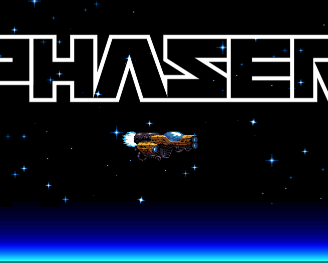

# Phaser's TS modules - Current version Phaser 3.90.0

This is a small project done in spare time that aims to convert Phaser files to TypeScript in order to have code that integrates more easily into TS projects and improve workflow.

**Phaser framework is a library created by Richard Davey and Phaser Studio Team.
Please visit the [official website](https://phaser.io/) for more information and oficial repository [here](https://github.com/photonstorm/phaser).**

## How to run the project

1. Clone the repository
2. Run `npm install`
3. Run `npm run dev`

## Roadmap:

Important: We ignore the obvious TypeScript errors in this first attempt.
What is an obvious error? Any error that arises from converting the code to TypeScript but works fine in the JavaScript version.

We will return to fix these errors later.

- [x] Create a base project with a simple example
- [ ] Convert all files to TS - current state
- [ ] Refactor the code to be more TS friendly - if is possible
- [ ] Add documentation
- [ ] Add examples

## Phaser's folder

The Phaser source code is located inside the `src/phaser` folder.

## Refactor 

I have added "// TODO: Fix types" in files that have been converted to TS and need a review with the new converted class types.
While not all code has been converted, phaser.d.ts will be used for intermediate types.

Los todo recomendados son:
// TODO: Fix types
// TODO: Refactor
// TODO: Check this code (if there are doubts about whether the code is correct.)

- [ ] src/display/color - needs refactor - and fix types

## Global Summary

- Total files: 2000
- TS files: 93
- JS files: 1907
- Percentage: 5%

## Progress by Namespace

  - [ ] actions (5%)
    - [x] typedefs (100%)
  - [ ] animations (0%)
    - [ ] events (0%)
    - [ ] typedefs (0%)
  - [ ] cache (0%)
    - [ ] events (0%)
  - [ ] cameras (0%)
    - [ ] 2d (0%)
      - [ ] effects (0%)
      - [ ] events (0%)
      - [ ] typedefs (0%)
    - [ ] controls (0%)
      - [ ] typedefs (0%)
  - [ ] core (0%)
    - [ ] events (0%)
    - [ ] typedefs (0%)
  - [ ] create (0%)
    - [ ] palettes (0%)
    - [ ] typedefs (0%)
  - [ ] curves (0%)
    - [ ] path (0%)
    - [ ] typedefs (0%)
  - [ ] data (0%)
    - [ ] events (0%)
  - [ ] device (0%)
  - [ ] display (77%)
    - [ ] align (93%)
      - [x] in (100%)
      - [x] to (100%)
    - [x] bounds (100%)
    - [ ] canvas (0%)
    - [x] color (100%)
    - [ ] mask (0%)
    - [ ] shader (0%)
    - [ ] typedefs (0%)
  - [x] dom (100%)
  - [ ] events (0%)
  - [ ] fx (0%)
  - [ ] gameobjects (0%)
    - [ ] bitmaptext (0%)
      - [ ] dynamic (0%)
      - [ ] static (0%)
      - [ ] typedefs (0%)
    - [ ] blitter (0%)
    - [ ] components (0%)
    - [ ] container (0%)
      - [ ] typedefs (0%)
    - [ ] domelement (0%)
    - [ ] events (0%)
    - [ ] extern (0%)
    - [ ] graphics (0%)
      - [ ] typedefs (0%)
    - [ ] group (0%)
      - [ ] typedefs (0%)
    - [ ] image (0%)
    - [ ] layer (0%)
    - [ ] lights (0%)
    - [ ] mesh (0%)
      - [ ] typedefs (0%)
    - [ ] nineslice (0%)
      - [ ] typedefs (0%)
    - [ ] particles (0%)
      - [ ] events (0%)
      - [ ] typedefs (0%)
      - [ ] zones (0%)
    - [ ] pathfollower (0%)
      - [ ] typedefs (0%)
    - [ ] plane (0%)
      - [ ] typedefs (0%)
    - [ ] pointlight (0%)
    - [ ] rendertexture (0%)
      - [ ] typedefs (0%)
    - [ ] rope (0%)
      - [ ] typedefs (0%)
    - [ ] shader (0%)
      - [ ] typedefs (0%)
    - [ ] shape (0%)
      - [ ] arc (0%)
      - [ ] curve (0%)
      - [ ] ellipse (0%)
      - [ ] grid (0%)
      - [ ] isobox (0%)
      - [ ] isotriangle (0%)
      - [ ] line (0%)
      - [ ] polygon (0%)
      - [ ] rectangle (0%)
      - [ ] star (0%)
      - [ ] triangle (0%)
    - [ ] sprite (0%)
      - [ ] typedefs (0%)
    - [ ] text (0%)
      - [ ] typedefs (0%)
    - [ ] tilesprite (0%)
      - [ ] typedefs (0%)
    - [ ] typedefs (0%)
    - [ ] video (0%)
      - [ ] typedefs (0%)
    - [ ] zone (0%)
      - [ ] typedefs (0%)
  - [ ] geom (0%)
    - [ ] circle (0%)
    - [ ] ellipse (0%)
    - [ ] intersects (0%)
    - [ ] line (0%)
    - [ ] mesh (0%)
      - [ ] typedefs (0%)
    - [ ] point (0%)
    - [ ] polygon (0%)
    - [ ] rectangle (0%)
    - [ ] triangle (0%)
    - [ ] typedefs (0%)
  - [ ] input (0%)
    - [ ] events (0%)
    - [ ] gamepad (0%)
      - [ ] configs (0%)
      - [ ] events (0%)
      - [ ] typedefs (0%)
    - [ ] keyboard (0%)
      - [ ] combo (0%)
      - [ ] events (0%)
      - [ ] keys (0%)
      - [ ] typedefs (0%)
    - [ ] mouse (0%)
    - [ ] touch (0%)
    - [ ] typedefs (0%)
  - [ ] loader (0%)
    - [ ] events (0%)
    - [ ] filetypes (0%)
      - [ ] typedefs (0%)
    - [ ] typedefs (0%)
  - [ ] math (0%)
    - [ ] angle (0%)
    - [ ] distance (0%)
    - [ ] easing (0%)
      - [ ] back (0%)
      - [ ] bounce (0%)
      - [ ] circular (0%)
      - [ ] cubic (0%)
      - [ ] elastic (0%)
      - [ ] expo (0%)
      - [ ] linear (0%)
      - [ ] quadratic (0%)
      - [ ] quartic (0%)
      - [ ] quintic (0%)
      - [ ] sine (0%)
      - [ ] stepped (0%)
    - [ ] fuzzy (0%)
    - [ ] interpolation (0%)
    - [ ] pow2 (0%)
    - [ ] random-data-generator (0%)
    - [ ] snap (0%)
    - [ ] typedefs (0%)
  - [ ] physics (0%)
    - [ ] arcade (0%)
      - [ ] components (0%)
      - [ ] events (0%)
      - [ ] tilemap (0%)
      - [ ] typedefs (0%)
    - [ ] matter-js (0%)
      - [ ] components (0%)
      - [ ] events (0%)
      - [ ] lib (0%)
        - [ ] body (0%)
        - [ ] collision (0%)
        - [ ] constraint (0%)
        - [ ] core (0%)
        - [ ] factory (0%)
        - [ ] geometry (0%)
        - [ ] plugins (0%)
        - [ ] render (0%)
      - [ ] poly-decomp (0%)
      - [ ] typedefs (0%)
  - [ ] plugins (0%)
    - [ ] typedefs (0%)
  - [ ] polyfills (0%)
  - [ ] renderer (0%)
    - [ ] canvas (0%)
      - [ ] utils (0%)
    - [ ] events (0%)
    - [ ] snapshot (0%)
      - [ ] typedefs (0%)
    - [ ] webgl (0%)
      - [ ] pipelines (0%)
        - [ ] events (0%)
        - [ ] fx (0%)
      - [ ] shaders (0%)
      - [ ] typedefs (0%)
      - [ ] wrappers (0%)
  - [ ] scale (0%)
    - [ ] const (0%)
    - [ ] events (0%)
  - [ ] scene (7%)
    - [ ] events (0%)
    - [ ] typedefs (0%)
  - [ ] sound (0%)
    - [ ] events (0%)
    - [ ] html5 (0%)
    - [ ] noaudio (0%)
    - [ ] typedefs (0%)
    - [ ] webaudio (0%)
  - [ ] structs (0%)
    - [ ] events (0%)
  - [ ] textures (0%)
    - [ ] events (0%)
    - [ ] parsers (0%)
    - [ ] typedefs (0%)
  - [ ] tilemaps (0%)
    - [ ] components (0%)
    - [ ] const (0%)
    - [ ] mapdata (0%)
    - [ ] parsers (0%)
      - [ ] impact (0%)
      - [ ] tiled (0%)
    - [ ] typedefs (0%)
  - [ ] time (0%)
    - [ ] events (0%)
    - [ ] typedefs (0%)
  - [ ] tweens (0%)
    - [ ] builders (0%)
    - [ ] events (0%)
    - [ ] tween (0%)
    - [ ] typedefs (0%)
  - [x] types (100%)
    - [x] actions (100%)
  - [ ] utils (12%)
    - [ ] array (0%)
      - [ ] matrix (0%)
    - [ ] base64 (0%)
    - [ ] object (0%)
    - [x] string (100%)

*Now it’s just the two of us, raw and exposed.*