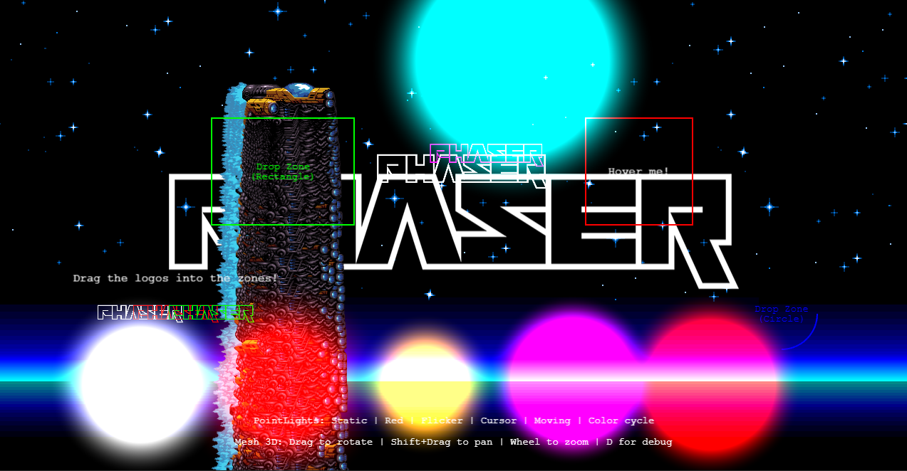

# Phaser Raw - Based on Phaser 4.0.0 RC6

This project is a community effort around a modern, TypeScript-based Phaser codebase that is easier to read and work with.

Our goal is simple: make Phaser friendlier for teams building real games today.

---

## What is this repository?

`phaser-raw` is a TypeScript-based Phaser codebase used in this repository.

---

## Current status

- The migration work is complete at project level.
- Current work focuses on quality polish and type improvements.
- Type-checking errors still exist and are being fixed incrementally.

---

## Quick start

1. Install dependencies:
   - `bun install`  
   - or `npm install`
2. Start development:
   - `bun run dev`  
   - or `npm run dev`
3. Build for production:
   - `bun run build`  
   - or `npm run build`

---

## About Phaser

Phaser is created by Richard Davey and the Phaser Studio team.  
Official website: [phaser.io](https://phaser.io)  
Official repository: [github.com/photonstorm/phaser](https://github.com/photonstorm/phaser)

---

TypeScript migration for this repository by Francisco Pereira.
